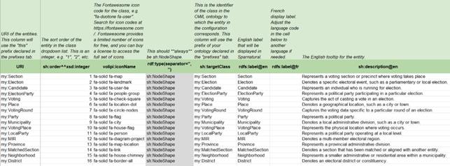
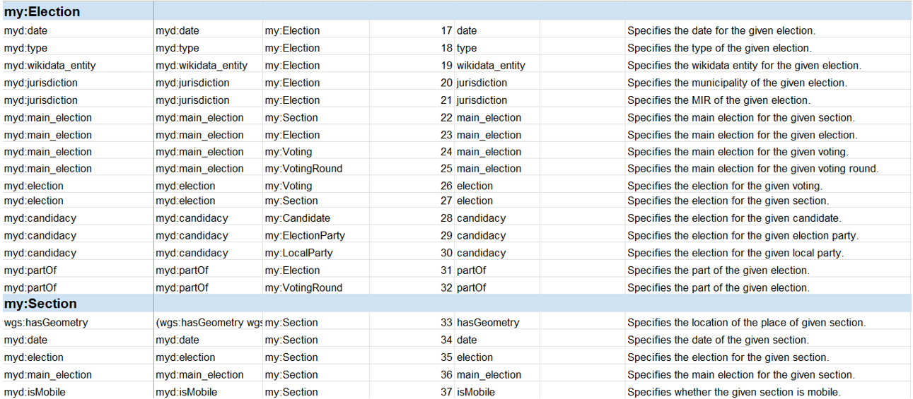
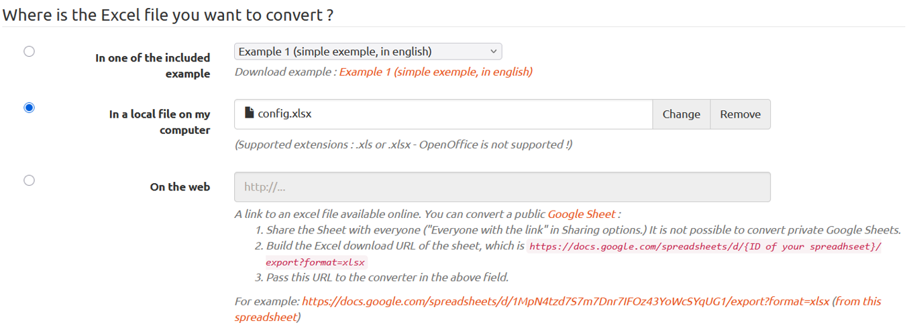
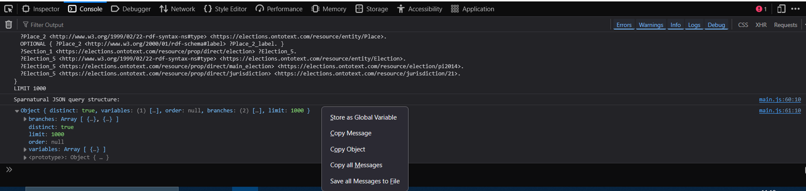
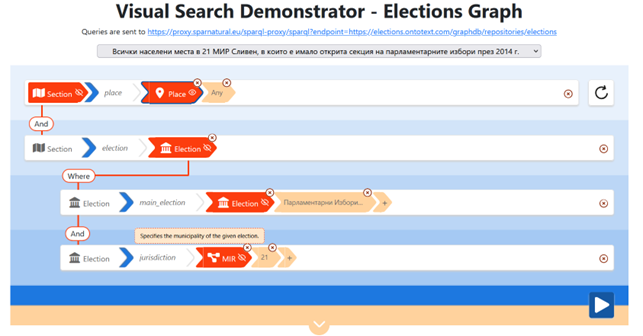

# Visual Search Demonstrator – Elections Graph

## Introduction

The project presents a **visual search demonstrator** built using **Sparnatural**, a tool that enables
intuitive **SPARQL query building** through a natural language-inspired interface. The goal of the
project is to provide an accessible, user-friendly way to explore and analyse election-related data
stored in **GraphDB** – a semantic graph database.

<p align="center"></p>

The application connects to an **RDF** dataset hosted on an **Ontotext GraphDB** instance via a public
**SPARQL** endpoint. The ontology and dataset focus on **Bulgarian elections**, including entities such
as municipalities, electoral districts (MIR), polling sections, political parties, candidates, and vote
counts across multiple years and election types. The project emphasizes ease of use, multilingual
support, and interactive exploration of linked election data through a web-based interface.

## Technology Stack


- **GraphDB** – graph database hosting the RDF election data and providing a public SPARQL endpoint
- **Sparnatural** – configurable visual SPARQL query builder used to create intuitive, natural language-like query interfaces over RDF data
- **IntelliJ IDEA** – IDE for editing the project files
- **Firefox Browser** – browser to be used for opening the project HTML page
- **Microsoft Excel** – tool to edit the configuration which is to be transformed in SHACL format

## Data

The core of this project is a curated **RDF dataset** related to **elections** in Bulgaria, stored in a semantic
graph database (**GraphDB**) and exposed via a **SPARQL** endpoint. The data is hosted on an **Ontotext
GraphDB** repository and accessed through the following public **SPARQL** endpoint:

```
https://elections.ontotext.com/graphdb/repositories/elections
```
A **proxy** that is described in the documentation of **Sparnatural** is used for **CORS compliance**. It
simply forwards the queries it receives to the target **SPARQL** endpoint. A query from server to server
is not subject to the **CORS** limitation:

```
https://proxy.sparnatural.eu/sparql-proxy/sparql?endpoint=https://elections.ontotext.com/graphdb/repositories/elections
```

The **RDF** dataset uses a domain-specific ontology tailored to the structure of **Bulgarian elections**.
The dataset is queried through a configuration (**myconfig.ttl**) that defines the **RDF** classes and
properties to be exposed in the **Sparnatural** interface. This configuration maps **SPARQL** patterns to
user-friendly labels and determines the visual structure of the query builder.

## Project Steps

### 1. Enable dynamic loading of local files in Firefox Browser

The first **challenge** that I had to resolve was the loading of local dynamic files in my browser. By
default, this is not possible and the **Sparnatural** widget will not load properly. This is because
browsers for **security reasons** disable by default the dynamic loading of other files from local
directories – in our case the **Sparnatural** configuration file. For it to work, we need to instruct the
browser that it is safe to dynamically load local files. This is called “ **enabling CORS for local files** ”.

The procedure to enable **CORS** for local files depends on the browser. For that project I chose to use
**Firefox Browser**. In order to make it **CORS-enabled** for local files the following steps are required:

1. Open **Firefox Browser**
2. Type **about:config** in the address bar
3. Accept **security warning**
4. Search for the config **security.fileuri.strict_origin_policy**
5. Set this config to **false**
6. **Restart** your browser to make sure this is taken into account

Once I followed these steps and configured this setting, I reopened the **index.html** page and I was
able to see the **Sparnatural** widget loading properly.

### 2. Connect with Elections Graph in GraphDB using proxy

**CORS** stands for **Cross-Origin Resource Sharing**. It is a mechanism by which a web client can
retrieve resources from a server different from the one which was originally loaded. With **CORS** ,
servers can indicate they allow clients loaded from other domains to send them requests. This
restriction applies to client-server interactions, not to server-server interactions.

In order to enable **CORS** on **GraphDB** , I needed to set some specific runtime properties. However,
since the repository is public, I am not an administrator and I do not have the full rights to modify the
settings. That is why I turned to the next option which is to use **Sparnatural SPARQL proxy**. This
solution is appropriate when we cannot modify the parameters, or the security policy do not allow it.
In that case, we use a **SPARQL proxy** that is provided by **Sparnatural** for that purpose and is **CORS-
enabled**. That will forward the request to a target **SPARQL** endpoint that is just acting as a bridge
between **Sparnatural** and the target **SPARQL** endpoint. This is only a temporary workaround, and
we must not use this proxy in production. In my project queries are sent to:

```
https://proxy.sparnatural.eu/sparql-proxy/sparql?endpoint=https://elections.ontotext.com/graphdb/repositories/elections
```

```html
<spar-natural
  src="myconfig.ttl"
  endpoint="https://proxy.sparnatural.eu/sparql-proxy/sparql?endpoint=https://elections.ontotext.com/graphdb/repositories/elections"
  lang="en"
  defaultLang="en"
  distinct="true"
  limit="1000"
  debug="true">
</spar-natural>
```

### 3. Setup configuration

My next step is to configure the **query builder** following the **structure** of the **elections data**. All this
was done in the configuration spreadsheet **config.xlsx**. This spreadsheet is actually a way to encode
a **SHACL** specification of my specific data model which **Sparnatural** will use as an input.

The **spreadsheet** consists of several tabs. The first one is **Prefixes**. There we have to define all
prefixes that will be used in the **SPARQL** queries. The next important tab is **Entities**. In that section
we have to define all the entity classes that will be used and are present in our data model. We have
to follow the instructions in the table when we fill it. We have to provide the order, the icon name, the
type, the label and the description.

<p align="center"></p>

The next important tab is **Properties**. This is the most crucial one because we have to describe all
types of relationships that are possible between the different classes of entities. As this has to be done
manually, I used the **SPARQL** editor in **GraphDB** to form suitable queries that can help me find the
relations and reverse engineer the knowledge graph. I managed to define **100 properties** divided into
different sections based on the key entity that I investigated.

<p align="center"></p>

The most important things that we have to point are the **subject class** and the **object class** , as well as
what type of property it is (**sh:Literal /xsd:integer**, **xsd:string**, **geo:wktLiteral**/, **sh:IRI**) and how
to visualise it (**core:ListProperty** , **core:NumberProperty**, **core:MapProperty**, **core:BooleanProperty**, etc.).

In addition, **Sparnatural** and **SHACL** provide some extended functionalities in **defining properties**.
One of them that I have used is **querying inverse properties**. That is when we want the user view to
differ from the underlying graph structure as we want to provide the user with an inverse relationship
that does not exist in the data. I used this scenario for **Section** and **Voting** classes. In the original
scenario, it was only possible for the **Voting** to be subject and the **Section** to be object. However, I
wanted to be able to see the results of the voting for given section from the subject **Section**. That is
why I used the special syntax: **[sh:inversePath myd:section]** to make a new property that I named
**hasResult**.

Another option that is provided is **querying a sequence of properties**. This is used when we want to
show the user a simplified view of the more elaborate structure in the graph with entities
corresponding to a selection of resources and properties corresponding to a path in the graph. We do
this in **SHACL** with the sequence path written in parenthesis “ **()** ”, containing the list of properties to
follow in sequence separated by a whitespace. In my visual search demonstrator, I have used that
syntax mainly for the map search elements where the coordinate points are in two following properties
distance. That is why I use: **(wgs:hasGeometry wgs:asWKT)** to make the illusion for the user that it is
only one property: **wgs:hasGeometry**.

Moreover, we can use **SHACL alternative paths** for specific cases with our data as in this scenario:

```
(myd:votingPlace [ sh:alternativePath (geo:hasGeometry wgs:hasGeometry) ] [ sh:alternativePath (geo:asWKT wgs:asWKT) ] )
```

The final important tab that I relied on is **Datasources**. By default, **Sparnatural** only extract a certain
number of results when it searches for labels. Therefore, I had to define **custom datasources** that
relied on the original one but without the **LIMIT** clause. Therefore, I copied the original from the
specification and adapted them for my use case.

### 4. Convert the spreadsheet in RDF

**Sparnatural** can be configured by a **SHACL** specification, and we can use an **Excel** spreadsheet to
start creating a **SHACL** config for **Sparnatural**. The configuration spreadsheet can be edited in a
local file or in an online (**Google**) spreadsheet. Before **Sparnatural** to be able to read the
configuration, it needs to be converted to **RDF**. This can be done with **Excel- 2 - RDF converter** that
is available from the **Sparna** organisation. For our local file conversion we can use the online form
at `https://skos-play.sparna.fr/play/convert?lang=en` and choose the field **In a local file on my
computer**. Then we check the **Ignore SKOS post-processings on the data** box at the bottom of
the form and click on **Convert** button. Finally, we save the results in the **myconfig.ttl** file that
contains our **SHACL specification**.

<p align="center"></p>

### 5. Create example queries

**Sparnatural** gives us an opportunity to save some **example queries** that we can display in the
**HTML** page. In order to save a query, we have to open the **developer console** of our browser and
copy the object that we see at the bottom only after we have constructed the desired query.

<p align="center"></p>

## Results

The **Sparnatural-based** elections visualization project successfully validates the feasibility of using
a visual query builder over **semantic election data**. It demonstrates how complex **SPARQL** queries
can be made **accessible** to users through an **intuitive interface** , removing the need for in-depth
technical knowledge. Throughout the development, challenges such as data modelling, RDF
transformation, and user interaction design were addressed to deliver a responsive and flexible search
experience.

<p align="center"></p>

